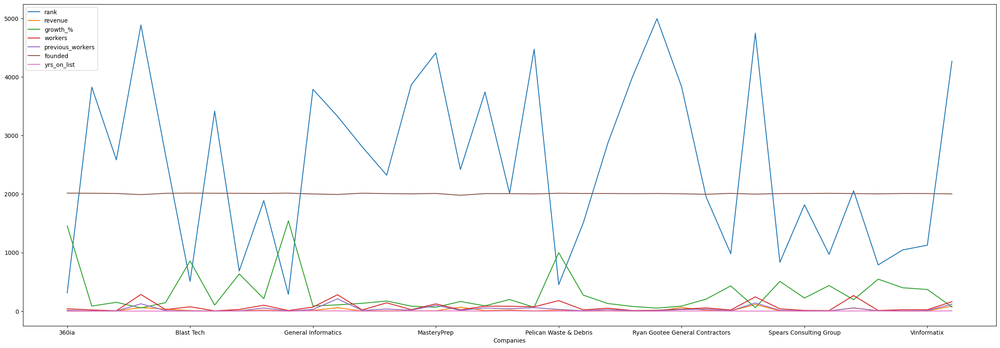
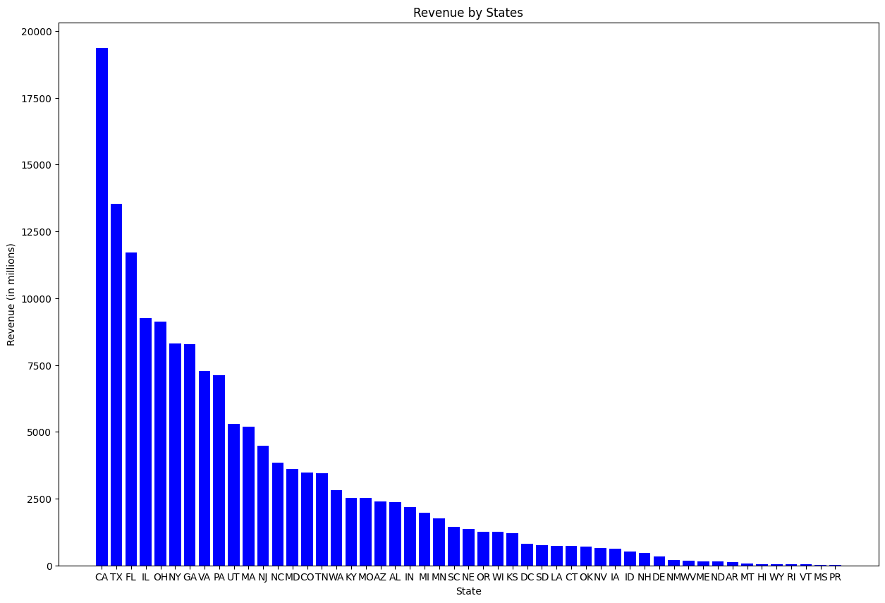
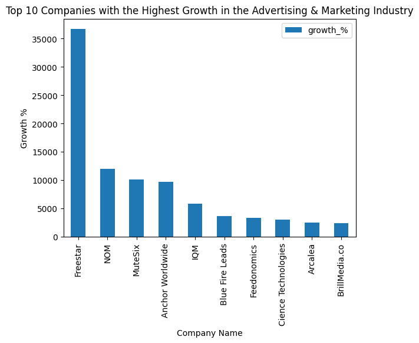
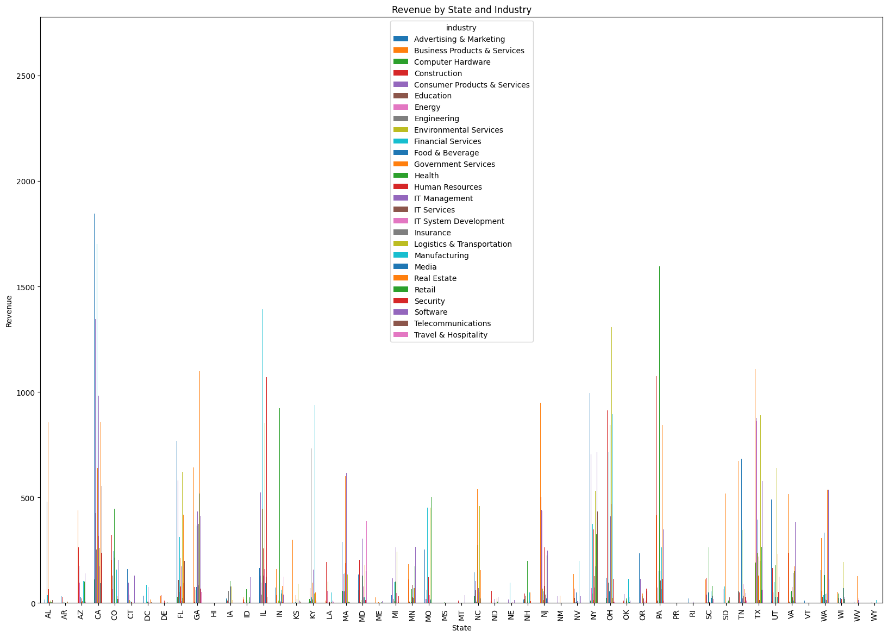

# 5000-US-Companies-Revenue-Analysis
Project Summary:
In this data analysis project, we worked with a data set that contained information about companies and their revenues. Our goal was to analyze the data and gain insights into the distribution of revenues across different industries and states.
We started by cleaning and transforming the data set to ensure that it was in a usable format for analysis. This involved removing any irrelevant columns and transforming the 'revenue' column from a string to a numerical value.

Next, we performed some exploratory data analysis to get a better understanding of the data. This involved plotting histograms, bar graphs, and other types of plots to visualize the distribution of revenues across different industries and states.

One key finding from our analysis was that the Advertising & Marketing industry was one of the highest-revenue industries in the data set. This was evident from our bar graph, which showed that states such as California, New York, and Texas had a high concentration of companies in this industry and were also generating the highest revenues.

We also found that there were a few outliers in the data set that were generating a significantly higher revenue than the rest of the companies. These outliers could have skewed the distribution of revenues and impacted our analysis.
In conclusion, this data analysis project provided valuable insights into the distribution of revenues across different industries and states. Our findings suggest that the Advertising & Marketing industry is one of the highest-revenue industries in the data set and that states such as California, New York, and Texas are key contributors to this revenue. This information could be useful for businesses that are looking to expand into high-revenue industries or geographic locations.

